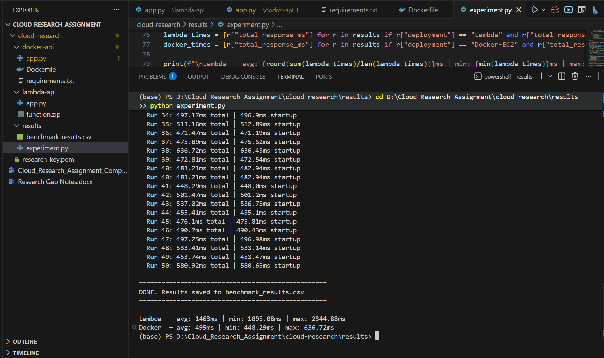
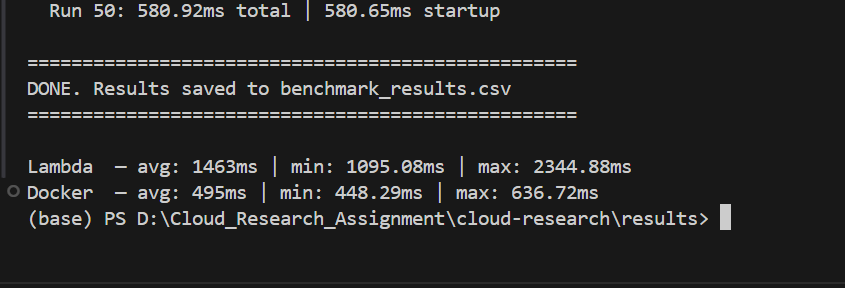
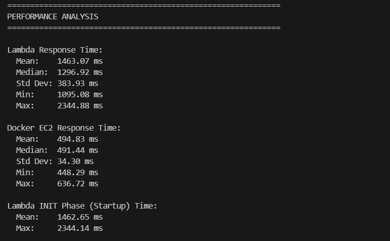
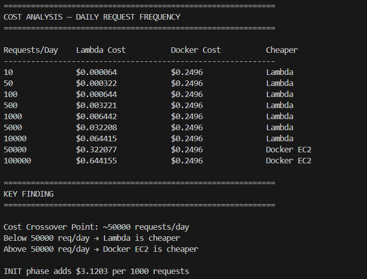

# ⚡ AWS Lambda vs Docker on EC2
## The Cost Impact of INIT Phase Billing on Serverless Deployment Decisions

> **TL;DR:** AWS changed how they bill Lambda in August 2025. Nobody has studied what this means for cost decisions. I did. The crossover point is not a single number — it shifts from 82,000 to 50,000 requests/day depending on workload intensity. Every prior cost model missed this entirely.

---

## 📄 Research Paper
**Title:** The Cost Impact of AWS Lambda's INIT Phase Billing on Serverless vs Container Deployment Decisions: An Empirical Analysis

**Author:** Muhammad Moazzam Hafeez — FAST NUCES Islamabad, Pakistan

**Status:** 🔄 Submitted 2026

---

## 🧠 The Problem In Plain English

When you use AWS Lambda, sometimes it "wakes up cold" — this delay is called a **cold start** or **INIT phase.**

For years, this was just a speed problem. Annoying, but free.

**On August 1, 2025, AWS started charging for it.**

Every paper ever written about Lambda costs missed this. Every cost model, every comparison, every benchmark — all assumed INIT phase = free.

**This research fixes that — and shows the crossover point shifts with workload complexity.**

---

## 🔬 What I Actually Did

Built the **same REST API twice** and tested at **3 workload levels:**

| | Deployment A | Deployment B |
|---|---|---|
| **Platform** | AWS Lambda | Docker on EC2 t3.micro |
| **Language** | Python 3.11 | Python 3.11 + Flask |
| **Billing** | Per request + INIT phase | Fixed $0.0104/hour |
| **Cold Start** | Yes — every idle invocation | Never |

| Workload | Computation | Runs |
|---|---|---|
| **Light** | Primes up to 500 | 100 runs each |
| **Medium** | Primes up to 5,000 | 100 runs each |
| **Heavy** | Primes up to 50,000 | 100 runs each |

**Total: 600 automated benchmark runs**

---

## 📊 Experiment Results

### Live Benchmark Running — 600 Automated Requests

*Real-time output of the benchmark script — 100 runs per workload per deployment*

### Final Summary Output

*Lambda avg 1,327ms–2,375ms vs Docker avg 498ms–545ms across workloads*

---

## 📈 Performance Analysis



| Workload | Lambda Mean | Docker Mean | Lambda Slower By |
|---|---|---|---|
| **Light** | 1,327 ms | 498 ms | **2.7x** |
| **Medium** | 1,432 ms | 527 ms | **2.7x** |
| **Heavy** | 2,375 ms | 545 ms | **4.4x** |

| Metric | Lambda (Light) | Docker (Light) |
|---|---|---|
| **Mean** | 1,327 ms | 498 ms |
| **Median** | 1,267 ms | 486 ms |
| **Std Deviation** | 306 ms 😬 | 109 ms ✅ |
| **INIT Phase** | 1,327 ms (99.97%) | 0 ms |

> As workload gets heavier, Lambda gets dramatically slower while Docker stays stable

---

## 💰 Cost Analysis



### Heavy Workload Cost Table
| Requests/Day | Lambda Cost | Docker Cost | Winner |
|---|---|---|---|
| 10 | $0.000053 | $0.2496 | ✅ Lambda |
| 100 | $0.000527 | $0.2496 | ✅ Lambda |
| 1,000 | $0.005266 | $0.2496 | ✅ Lambda |
| 5,000 | $0.026330 | $0.2496 | ✅ Lambda |
| 10,000 | $0.052661 | $0.2496 | ✅ Lambda |
| 50,000 | $0.263304 | $0.2496 | ✅ Docker EC2 |
| 100,000 | $0.526607 | $0.2496 | ✅ Docker EC2 |

---

## 🎯 The Key Finding

```
╔══════════════════════════════════════════════════════════╗
║         COST CROSSOVER POINT IS WORKLOAD-DEPENDENT       ║
║                                                          ║
║   Light workload  →  crossover at ~82,000 req/day  ✅   ║
║   Medium workload →  crossover at ~76,700 req/day  ✅   ║
║   Heavy workload  →  crossover at ~50,000 req/day  ✅   ║
║                                                          ║
║   39% shift driven entirely by INIT phase billing        ║
║   (a cost that was $0.00 in ALL prior research)          ║
╚══════════════════════════════════════════════════════════╝
```

**Provisioned Concurrency note:** Even with PC enabled ($0.0000041667/GB-s), Lambda stays above the Docker EC2 cost threshold at high volumes — PC eliminates latency but does not solve the cost disadvantage.

---

## 📁 Repository Structure

```
cloud-research/
│
├── lambda-api/
│   ├── app.py                   # Lambda function — 3 workload levels
│   └── function.zip             # Deployment package
│
├── docker-api/
│   ├── app.py                   # Flask API — identical logic
│   ├── Dockerfile               # Container definition
│   └── requirements.txt         # Dependencies
│
├── results/
│   ├── experiment.py            # Original 100-run benchmark script
│   ├── experiment_v2.py         # 600-run multi-workload script
│   ├── cost_analysis.py         # Original cost model
│   ├── cost_analysis_v2.py      # Multi-workload cost + crossover
│   ├── create_charts.py         # Chart generation script
│   ├── benchmark_results.csv    # Original 100-run raw data
│   └── benchmark_results_v2.csv # Full 600-run raw data
│
└── README.md
```

---

## 🚀 Reproduce This Experiment

### Prerequisites
- AWS account (Free Tier works)
- Python 3.11
- Docker Desktop

### Step 1 — Deploy Lambda
```bash
cd lambda-api
pip install awscli
aws configure
powershell Compress-Archive -Path app.py -DestinationPath function.zip
aws lambda create-function --function-name cloud-research-api \
  --runtime python3.11 \
  --role arn:aws:iam::YOUR_ACCOUNT_ID:role/lambda-research-role \
  --handler app.lambda_handler \
  --zip-file fileb://function.zip
aws lambda create-function-url-config --function-name cloud-research-api --auth-type NONE
```

### Step 2 — Deploy Docker on EC2
```bash
# Launch EC2 t3.micro on AWS Console, SSH in, then:
docker build -t research-api .
docker run -d -p 5000:5000 research-api
```

### Step 3 — Run the Full Benchmark
```bash
cd results
pip install requests matplotlib
python experiment_v2.py     # 600 runs across 3 workloads
python cost_analysis_v2.py  # crossover points per workload
python create_charts.py     # generates Fig 1 and Fig 2
```

---

## 🔑 Why This Matters

**For developers:**
The crossover point is not a fixed number. A lightweight webhook handler has a different threshold than a data-processing API. This research gives you workload-specific guidance for the first time.

**For DevOps engineers:**
Every cost calculator, every AWS blog post, every comparison article still uses the old pre-August 2025 billing model. This gives you updated, empirically validated numbers.

**For researchers:**
This is the first empirical study to incorporate AWS Lambda's August 2025 INIT phase billing change into a crossover analysis across multiple workload intensities. 13 papers reviewed — zero accounted for it.

---

## 🛠 Tech Stack


---

## 📬 Contact

**Muhammad Moazzam Hafeez**
FAST NUCES — Department of Computer Science, Islamabad, Pakistan
📧 i221093@nu.edu.pk
🔗 [GitHub](https://github.com/MoazzamHafeez1093)

---

*Research conducted March 2026 | 600 experimental runs | 3 workload levels | AWS us-east-1*